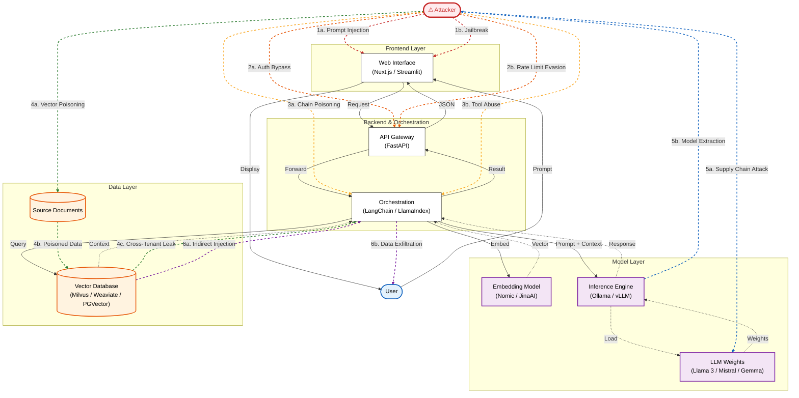

# Attack Paths: The Open Source AI Stack

This diagram overlays major attack vectors on the AI system data flow architecture. Each attack category has a **distinct color** for easy identification.

---

## Legend

| Color | Category | Attack Vectors |
|:-----:|----------|----------------|
| 🔴 **Red** | 1. Frontend Attack | Prompt Injection, Jailbreak |
| 🟠 **Orange** | 2. API Attack | Auth Bypass, Rate Limit Evasion |
| 🟡 **Gold** | 3. Orchestrator Attack | Chain Poisoning, Tool Abuse |
| 🟢 **Green** | 4. Vector DB Attack | Vector Poisoning, Cross-Tenant Leak |
| 🔵 **Blue** | 5. Model Layer Attack | Supply Chain, Model Extraction |
| 🟣 **Purple** | 6. End-to-End Attack | Indirect Injection (RAG), Data Exfiltration |

---

## Attack Path Details

| # | Path | Entry Point | Impact | Mitigation |
|---|------|-------------|--------|------------|
| 1a | Prompt Injection | User input | Bypass safety filters, extract data | Input validation, output filtering, system prompt hardening |
| 1b | Jailbreak | User input | Override system instructions | Guardrails (Llama Guard), content moderation, prompt shields |
| 2a | Auth Bypass | API Gateway | Unauthorized access | OAuth 2.0/OIDC, API key rotation, zero-trust architecture |
| 2b | Rate Limit Evasion | API Gateway | DoS, resource exhaustion | Adaptive rate limiting, CAPTCHA, request throttling |
| 3a | Chain Poisoning | Orchestrator | Corrupt reasoning chain | Chain validation, step-by-step verification, sandboxing |
| 3b | Tool Abuse | Orchestrator | Execute unintended tools | Tool allowlisting, permission scoping, human-in-the-loop |
| 4a | Vector Poisoning | Documents | Inject malicious content | Document provenance, content signing, ingestion validation |
| 4b | Poisoned Data | Vector DB | Serve corrupted context | Anomaly detection, embedding integrity checks |
| 4c | Cross-Tenant Leak | Vector DB | Access other users' data | Tenant isolation, namespace separation, RBAC |
| 5a | Supply Chain Attack | LLM Weights | Backdoored model behavior | Model checksums, signed weights, trusted registries |
| 5b | Model Extraction | Inference | Steal model via queries | Query rate limiting, output perturbation, watermarking |
| 6a | Indirect Injection | RAG Context | Hidden instructions in docs | Context sanitization, instruction hierarchy, grounding |
| 6b | Data Exfiltration | Response | Leak sensitive data to user | Output filtering, PII detection, response auditing |
