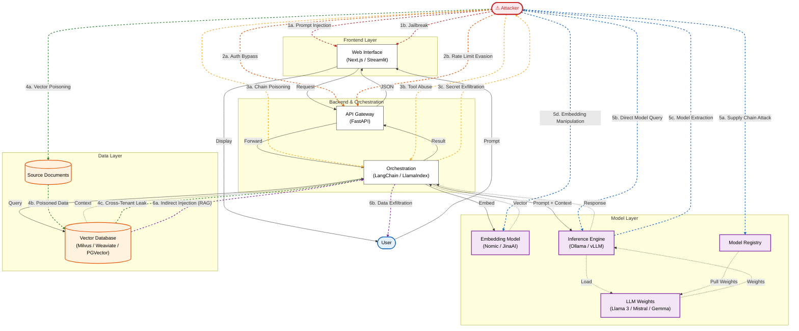

# Attack Paths: The Open Source AI Stack

This diagram overlays major attack vectors on the AI system data flow architecture. Each attack category has a **distinct color** for easy identification.

---

## Legend

| Color | Category | Attack Vectors |
|:-----:|----------|----------------|
| 🔴 **Red** | 1. Frontend Attack | Prompt Injection, Jailbreak |
| 🟠 **Orange** | 2. API Attack | Auth Bypass, Rate Limit Evasion |
| 🟡 **Gold** | 3. Orchestrator Attack | Chain Poisoning, Tool Abuse |
| 🟢 **Green** | 4. Vector DB Attack | Vector Poisoning, Cross-Tenant Leak |
| 🔵 **Blue** | 5. Model Layer Attack | Supply Chain, Model Extraction |
| 🟣 **Purple** | 6. End-to-End Attack | Indirect Injection (RAG), Data Exfiltration |

---

## Attack Path Details

| #  | Path                   | Entry Point        | Impact                        | Mitigation                                 |
| -- | ---------------------- | ------------------ | ----------------------------- | ------------------------------------------ |
| 1a | Prompt Injection       | User → UI          | Override system instructions  | Prompt isolation, system message hardening |
| 1b | Jailbreak              | User → UI          | Disable safety layers         | Guard models, layered moderation           |
| 2a | Auth Bypass            | API                | Unauthorized API usage        | OAuth2/OIDC, mTLS                          |
| 2b | Rate Limit Evasion     | API                | DoS / cost explosion          | Adaptive rate limiting                     |
| 3a | Chain Poisoning        | Orchestrator       | Corrupt reasoning chain       | Step verification, execution sandbox       |
| 3b | Tool Abuse             | Orchestrator       | Lateral system compromise     | Tool allowlist, scoped credentials         |
| 3c | Secret Exfiltration    | Tool execution     | Leak tokens / secrets         | Vault-based secret isolation               |
| 4a | Vector Poisoning       | Document ingestion | Malicious context injection   | Content signing, ingestion validation      |
| 4b | Poisoned Retrieval     | Vector DB          | Context corruption            | Retrieval anomaly detection                |
| 4c | Cross-Tenant Leak      | Vector DB          | Data exposure                 | Namespace isolation, RBAC                  |
| 5a | Model Supply Chain     | Registry           | Backdoored weights deployed   | Signed artifacts, checksum validation      |
| 5b | Direct Model Query     | Inference          | Bypass orchestration controls | Network segmentation                       |
| 5c | Model Extraction       | Inference          | Intellectual property theft   | Query monitoring, watermarking             |
| 5d | Embedding Manipulation | Embedding model    | Skew retrieval behavior       | Model integrity checks                     |
| 6a | Indirect Injection     | RAG context        | Hidden instruction execution  | Context sanitization                       |
| 6b | Data Exfiltration      | Response channel   | Sensitive data leakage        | Output filtering, PII scanning             |

