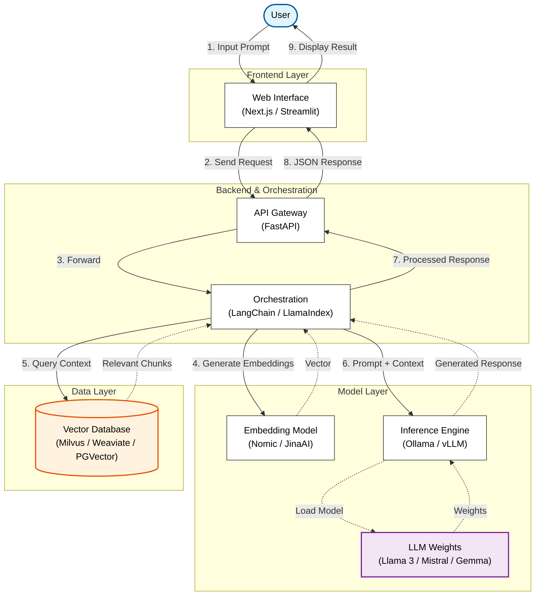

# Data Flow Diagram: The Open Source AI Stack

Based on the architecture concepts of "The Open Source AI Stack", here is a data flow diagram representing the interaction between the User, Frontend, Backend, Data, and Model layers.

